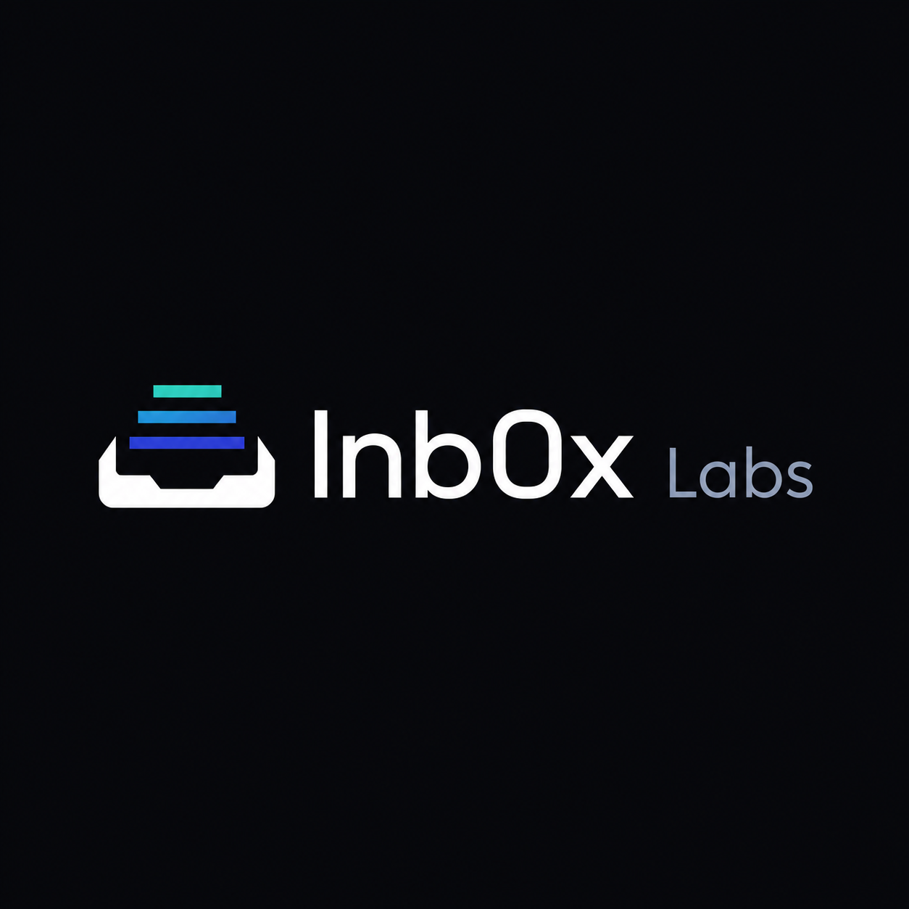
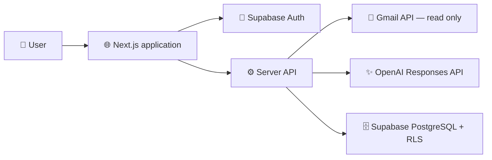

<div align="center">



# 📬 Inb0x

### Turn inbox overload into a clear action plan.

Inb0x is an AI-powered email productivity workspace that summarizes Gmail threads,
surfaces deadlines, extracts tasks, prioritizes what matters, and helps people work
toward Inbox Zero—without changing anything in their mailbox.

Repository contributors and Codex sessions must follow [PROJECT_RULES.md](PROJECT_RULES.md).
Frontend work also follows [DESIGN_RULES.md](DESIGN_RULES.md).

[](#-project-status)
[](#-privacy-first-by-design)
[](LICENSE)
[](#-hackathon)

[Features](#-features) • [Architecture](#%EF%B8%8F-architecture) • [Getting Started](#-getting-started) • [Security](#-security) • [Roadmap](#%EF%B8%8F-roadmap)

</div>

---

## ✨ What is Inb0x?

Busy inboxes hide important work between newsletters, notifications, long threads,
and low-priority messages. Inb0x converts recent Gmail conversations into a focused
productivity view so users can understand what needs attention without repeatedly
reading every message.

> **Core promise:** useful assistance, clear user control, and zero hidden mailbox actions.

## 🖼️ Preview

<div align="center">

> The complete credential-free demo is available locally with `DEMO_MODE=true`.

</div>

## 🚀 Features

| Capability                  | What it does                                                                             |
| --------------------------- | ---------------------------------------------------------------------------------------- |
| 🧠 **Thread summaries**     | Turns long conversations into concise, evidence-based summaries.                         |
| 🎯 **Smart prioritization** | Scores messages by urgency, importance, and whether a reply is needed.                   |
| ✅ **Action extraction**    | Suggests actionable work that users explicitly accept as manageable tasks.               |
| ☑️ **Task management**      | Manages manual or email-linked tasks with evidence, due dates, and priorities.           |
| 📅 **Deadline detection**   | Surfaces supported dates, deadlines, and meeting details.                                |
| 🏷️ **Email classification** | Organizes messages into useful categories such as work, finance, meetings, and security. |
| ✍️ **Reply studio**         | Generates grounded plain-text drafts with tone and length controls for manual copying.   |
| 📊 **Inbox insights**       | Highlights patterns and productivity signals across the inbox.                           |
| 📈 **Dashboard API**        | Aggregates persisted focus, tasks, drafts, usage, and trends without provider calls.     |
| 🎭 **Demo mode**            | Provides a complete fictional inbox experience without Gmail or AI credentials.          |

## 🔒 Privacy first by design

Inb0x is intentionally **read-only**. The MVP requests only
`gmail.readonly` access and does not perform mailbox mutations.

Inb0x will never:

- send, delete, archive, or mark an email as read;
- modify Gmail labels or download attachments;
- run automatic replies or take hidden actions;
- expose Gmail tokens to the browser;
- follow instructions embedded inside untrusted email content.

Reply suggestions remain drafts inside Inb0x and must be copied manually by the user.
They expose `copyOnly: true` and `sent: false`; Inb0x has no send route or Gmail draft creation.
See [SECURITY.md](SECURITY.md) for the vulnerability disclosure policy and security model.

## 🏗️ Architecture

Frontend decisions are documented in [DESIGN_RULES.md](DESIGN_RULES.md) and
[docs/FRONTEND_ARCHITECTURE.md](docs/FRONTEND_ARCHITECTURE.md). The product is dark-first, uses no
green-family UI colors, and avoids textual pillboxes.

Settings and account controls use authenticated, user-scoped APIs for validated preferences, safe
JSON export, Gmail disconnect, and explicit account deletion. Loading settings never triggers Gmail
sync, OpenAI analysis, or reply generation.



The application follows a layered architecture:

- **Web and API:** Next.js App Router with strict TypeScript contracts.
- **Identity and data:** Supabase Auth, PostgreSQL, and Row Level Security.
- **Mailbox connection:** Google OAuth and the official Gmail API client.
- **AI analysis:** OpenAI Responses API with strict structured outputs.
- **Validation and testing:** Zod, Vitest, Testing Library, and Playwright.
- **Task integrity:** explicit acceptance, source evidence, ownership checks, and idempotent writes.
- **Deployment:** Vercel-compatible server code with GitHub Actions checks.

## 🧰 Technology stack

| Area              | Technology                                    |
| ----------------- | --------------------------------------------- |
| Frontend          | Next.js, React, TypeScript, Tailwind CSS      |
| Backend           | Next.js Route Handlers, Node.js               |
| Database and auth | Supabase Auth, PostgreSQL, Row Level Security |
| Email integration | Google OAuth 2.0, Gmail API                   |
| AI                | OpenAI Responses API, Structured Outputs      |
| Validation        | Zod                                           |
| Quality           | ESLint, Prettier, Vitest, Playwright          |
| Hosting           | Vercel                                        |

## 📦 Getting started

> The technical foundation and deterministic demo are available. Real mode additionally
> requires the provider setup documented below.

### Prerequisites

- Node.js 20 or newer
- npm 10 or newer
- Git

### Local setup

```bash
git clone https://github.com/Z1esco/Inb0x-Labs.git
cd Inb0x-Labs
npm install
cp .env.example .env.local
npm run dev
```

Open [http://localhost:3000](http://localhost:3000) in your browser.

### 🎭 Demo mode

Demo mode is designed to run with fictional data and no Gmail or OpenAI credentials:

```env
DEMO_MODE=true
```

### 🔌 Real mode

Real mode requires a Supabase project. Gmail and OpenAI features require their provider credentials
only when those features are enabled:

```env
DEMO_MODE=false
```

Never commit `.env.local`, provider secrets, encryption keys, or service-role keys.

## ⚙️ Environment variables

The authoritative inventory is [.env.example](.env.example), with exposure and deployment guidance
in [docs/ENVIRONMENT.md](docs/ENVIRONMENT.md). Key configuration groups are:

| Group        | Variables                                                                                 |
| ------------ | ----------------------------------------------------------------------------------------- |
| Application  | `NEXT_PUBLIC_APP_URL`, `DEMO_MODE`                                                        |
| Supabase     | `NEXT_PUBLIC_SUPABASE_URL`, `NEXT_PUBLIC_SUPABASE_ANON_KEY`, `SUPABASE_SERVICE_ROLE_KEY`  |
| Google OAuth | `GOOGLE_CLIENT_ID`, `GOOGLE_CLIENT_SECRET`, `GOOGLE_REDIRECT_URI`, `OAUTH_STATE_SECRET`   |
| Encryption   | `TOKEN_ENCRYPTION_KEY`                                                                    |
| OpenAI       | `OPENAI_API_KEY`, `OPENAI_MODEL`, `OPENAI_REASONING_EFFORT`                               |
| Usage limits | `ANALYSIS_DAILY_LIMIT`, `REPLY_DAILY_LIMIT`, `GMAIL_MAX_THREADS`, `THREAD_MAX_CHARACTERS` |

## 🗄️ Database and external services

- Database migrations and RLS policies are documented in `docs/DATABASE.md`.
- Google OAuth setup and callback URLs are documented in `docs/GOOGLE_OAUTH.md`.
- OpenAI model and cost configuration is documented in `docs/OPENAI.md`.
- Task acceptance, deduplication, lifecycle, and demo behavior are documented in `docs/TASKS.md`.
- Full local and production setup will be documented in `docs/SETUP.md`.

## 🧪 Quality checks

```bash
npm run format:check
npm run lint
npm run typecheck
npm test
npm run build
npx supabase test db supabase/tests/production_security.sql
```

Run the complete verification pipeline with:

```bash
npm run check
```

Tests mock Gmail and OpenAI integrations; automated tests must never call real user
mailboxes or consume paid AI requests.

`GET /api/dashboard` returns deterministic demo or user-owned persisted metrics without calling
Gmail/OpenAI or triggering mutations. The merged interface includes responsive Dashboard, Inbox,
Thread, Tasks, Drafts, Insights, and Settings screens.

## 🚢 Deployment

Inb0x is Vercel-ready but has not been deployed by this repository task. Production deployment requires:

1. Supabase migrations and RLS policies applied.
2. Server-side environment variables configured in Vercel.
3. Production Google OAuth and Supabase redirect URLs registered.
4. Demo mode verified before testing with a dedicated Gmail account.

No deployment is performed automatically from this documentation.
Follow [docs/PRODUCTION_CHECKLIST.md](docs/PRODUCTION_CHECKLIST.md) and
[docs/RELEASE_RUNBOOK.md](docs/RELEASE_RUNBOOK.md); do not enable real mode until the previously
exposed Supabase privileged secret has been rotated.

Apply the forward-only migrations in filename order:

1. `20260716084341_initial_schema.sql`
2. `20260716140053_task_management.sql`
3. `20260716163436_reply_drafts.sql`
4. `20260716185440_settings_preferences.sql`
5. `20260717120000_harden_server_managed_tables.sql`

### Known limitations

- Real Supabase, Google, Gmail, OpenAI, and Vercel flows require dedicated-account live verification.
- The lightweight burst limiter is process-local; daily AI quotas are database-atomic, but production
  burst limiting should use a shared store before broad public traffic.
- Retention cleanup is opportunistic/manual; this MVP has no scheduler or background job system.
- Demo mutations are in memory and reset when the server process restarts.
- Google testing-mode and restricted-scope verification rules can limit refresh-token lifetime and users.

## 💸 Cost controls

The MVP targets **RM0 fixed infrastructure cost** where free tiers permit. It avoids
background agents, cron jobs, embeddings, vector databases, Redis, and automatic
analysis. AI work starts only after an explicit user action and is protected by:

- daily and batch analysis limits;
- content-hash and prompt-version caching;
- normalized thread-size limits;
- at most one retry for transient model failures;
- deterministic, credential-free demo results.

## 🤝 Team ownership

| Area                                                                                      | Owner            |
| ----------------------------------------------------------------------------------------- | ---------------- |
| Foundation, backend, integrations, data, security, tests, deployment, documentation       | Technical lead   |
| Final screens, responsive styling, charts, animation, Figma implementation, visual polish | Frontend partner |

Backend contracts and mock data are designed to let frontend work progress independently.
Detailed collaboration boundaries will be maintained in `docs/OWNERSHIP.md` and
`docs/PARTNER_HANDOFF.md`.

## 🛡️ Security

Please do **not** disclose suspected vulnerabilities in a public issue. Follow the
responsible disclosure process in [SECURITY.md](SECURITY.md). Key safeguards include:

- least-privilege, read-only Gmail access;
- encrypted OAuth tokens stored server-side;
- OAuth state validation and secure cookies;
- per-user Row Level Security policies;
- strict validation and safe API error responses;
- prompt-injection defenses and sanitized email content;
- structured logs that exclude secrets and private email bodies.

## 🏆 Hackathon

Inb0x is being built by **Inb0x Labs** for the **Apps for Your Life** hackathon
category. The project focuses on a practical daily problem: helping people turn email
overload into clear, safe, and manageable next steps.

## 🗺️ Roadmap

- [x] Complete the secure application foundation and API contracts
- [x] Add read-only Gmail OAuth and synchronization
- [x] Add structured AI analysis and reply drafting
- [x] Ship deterministic demo mode and seeded inbox data
- [x] Complete the frontend experience and responsive visual polish
- [x] Add integration, browser, and security regression coverage
- [ ] Prepare the Vercel demo deployment

## 📍 Project status

> **Production-ready candidate, pending live-provider verification.** The credential-free demo,
> responsive interface, APIs, migrations, tests, and CI are implemented. Provider-backed real mode
> requires secret rotation, external setup, migration application, two-user isolation testing, and
> the manual deployment checks in `docs/PRODUCTION_CHECKLIST.md`.

## 📄 License

This project is licensed under the [MIT License](LICENSE).

---

<div align="center">

Built with focus, care, and a healthier inbox in mind. 💙

**[⬆ Back to top](#-inb0x)**

</div>
