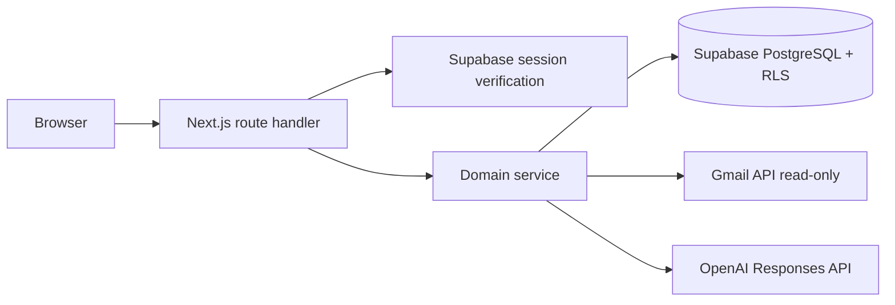

# Architecture

Inb0x is a Vercel-compatible Next.js App Router application. Route handlers authenticate,
validate with Zod, call services, and return a shared response contract. Provider and database
logic stays in `src/server`; routes never contain Gmail parsing or AI prompt logic.

## Authentication and Gmail authorization

Supabase Google sign-in establishes the application session. Gmail authorization is a second,
explicit OAuth authorization-code flow. The server stores a keyed hash of random, user-bound,
expiring state and sends the raw value only through Google plus an HTTP-only SameSite cookie.
The callback atomically consumes state, exchanges the code, validates scopes and Google identity,
and encrypts provider tokens. Gmail scopes are restricted to identity and `gmail.readonly`.

## Gmail synchronization

An explicit sync request obtains a server-only authenticated Google client, lists recent inbox
threads with a bounded query, and retrieves full thread payloads with four-worker concurrency,
timeouts, and one transient retry. The normalizer prefers plain text, converts HTML to inert text,
detects but never downloads attachments, trims duplicate history, caps newest context, hashes the
stable result, and conditionally persists by user and Gmail thread ID. Routes read only persisted,
owned projections; `docs/GMAIL_SYNC.md` records the complete trust boundary.

## AI analysis and reply drafts

Analysis is explicit and ownership-checked. The Responses API parses strict Zod-backed Structured
Outputs; a post-validator grounds excerpts and source IDs before any persistence. Email content is
JSON data inside a delimiter in the user input, separate from the system trust boundary. Cache
identity includes thread, content hash, prompt version, schema version, and configured model. Reply
generation remains separate and returns only a local draft; no Gmail write or send client exists.

## Demo mode

`DEMO_MODE=true` replaces credentials and providers with deterministic fictional threads,
analyses, tasks, drafts, settings, and insights behind the same public contracts. Reset restores
in-memory state. Server restart also resets it; demo mode does not require filesystem persistence.

## Task management

Task routes delegate to `src/server/tasks/task-service.ts`; production database access is isolated in
the task repository and all rows are explicitly scoped by the authenticated user. Analysis action
items remain suggestions until an explicit create-from-analysis request. A deterministic source key
plus a database unique constraint makes acceptance idempotent under concurrent requests. A database
trigger independently validates that linked threads and analyses belong to the task owner.

## Caching, rate limiting, and cost control

Analysis caching uses `email_thread_id + content_hash + prompt_version + schema_version + model`.
An atomic PostgreSQL reservation function serializes each user's UTC-day usage count before a real
model call; cache hits and demo results do not reserve usage. Lightweight per-user action buckets
protect request bursts in this MVP. Inputs, batches, concurrency, timeouts, and retries are bounded.

## Data deletion

Disconnect attempts Google revocation, then deletes local encrypted tokens even if revocation
fails. Confirmed data deletion removes provider connections and user content in dependency order.
Retention cleanup clears expired normalized email text while preserving minimal metadata and
derived output.
