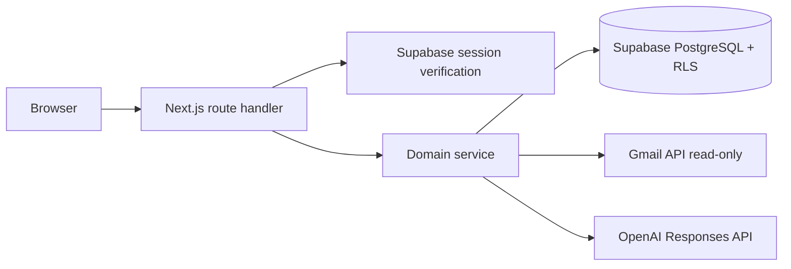

# Architecture

Inb0x is a Vercel-compatible Next.js App Router application. Route handlers authenticate,
validate with Zod, call services, and return a shared response contract. Provider and database
logic stays in `src/server`; routes never contain Gmail parsing or AI prompt logic.

## Authentication and Gmail authorization

Supabase Google sign-in establishes the application session. Gmail authorization is a second,
explicit OAuth authorization-code flow. The server signs a random, expiring state value, stores
it in an HTTP-only SameSite cookie, validates it on callback, exchanges the code, and encrypts
provider tokens. Gmail scopes are restricted to identity and `gmail.readonly`.

## Gmail synchronization

An explicit sync request loads encrypted credentials, lists recent inbox threads with a bounded
query, retrieves full message payloads in batches of five, prefers plain text, converts HTML to
text, detects but never downloads attachments, caps content, hashes it, and upserts by user and
Gmail thread ID.

## AI analysis and reply drafts

Analysis is explicit, quota-controlled, and cached by thread content hash plus prompt version.
The Responses API parses strict Zod-backed structured output. Email content is placed in the
untrusted user-data position after a system trust boundary. Reply generation returns a local
draft only; no Gmail write or send client exists.

## Demo mode

`DEMO_MODE=true` replaces credentials and providers with deterministic fictional threads,
analyses, tasks, drafts, settings, and insights behind the same public contracts. Reset restores
in-memory state. Server restart also resets it; demo mode does not require filesystem persistence.

## Caching, rate limiting, and cost control

Analysis caching uses `email_thread_id + content_hash + prompt_version`. Daily usage events
enforce AI quotas. Lightweight per-user action buckets protect the demo and single-instance MVP;
the schema includes `rate_limits` for a production atomic database implementation. Inputs,
batches, timeouts, and retries are bounded.

## Data deletion

Disconnect attempts Google revocation, then deletes local encrypted tokens even if revocation
fails. Confirmed data deletion removes provider connections and user content in dependency order.
Retention cleanup clears expired normalized email text while preserving minimal metadata and
derived output.
